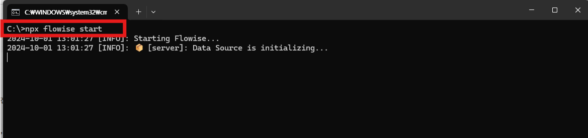
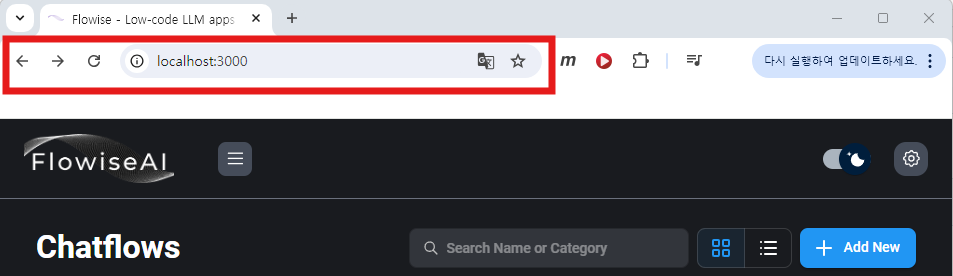
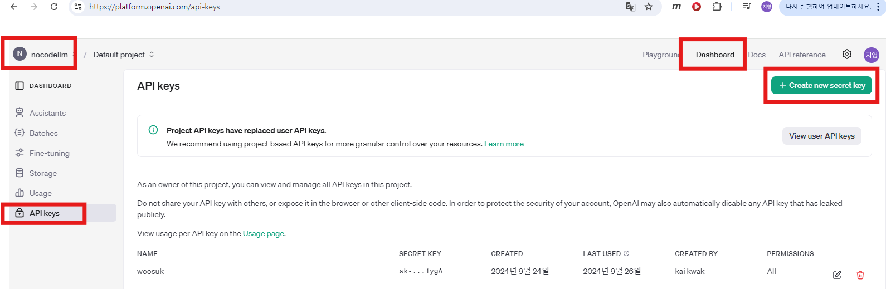
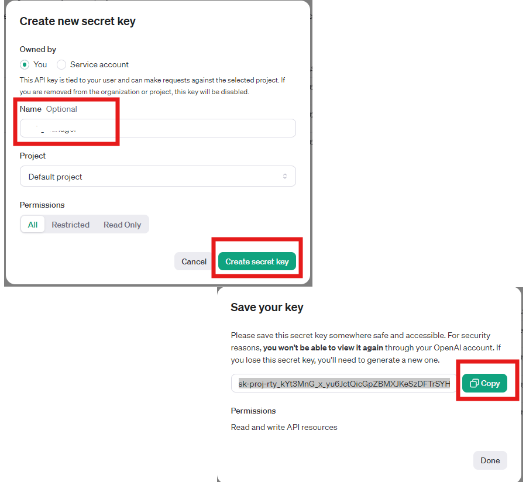
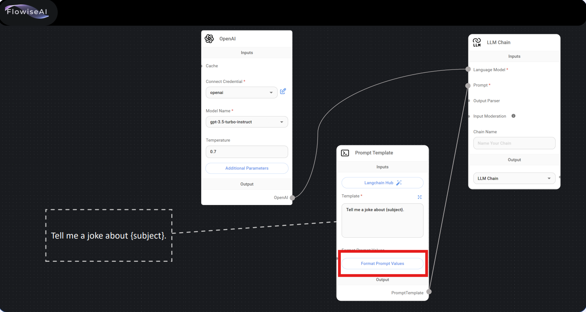
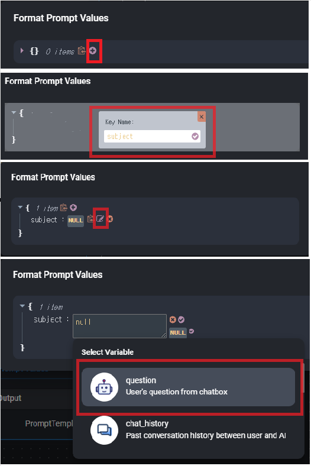

## Flowise 실행하기


1. npx flowise start 입력
<br>



2. 크롬을 열고 , localhost:3000 입력
3. flowise 접속을 확인한다.


## Flowise Update / Uninstall

### Update

```
npm update -g flowise
```

### Uninstall

```
npm uninstall -g flowise
```


<br><br><br>
## OpenAI API keys 발급하기
1. 해당주소로 접속하여 로그인 https://platform.openai.com/
2. Dashboard > API keys로 접속  
3. Create new secret key 선택
   <br>
  
<br>
<b>4. Name에 본인이 원하는 id를 입력한다. key 값은 다시 볼 수 없기 때문에 무조건 저장해 둔다.</b> <br><br>

  <br>
<br>

<br><br><br>
## 1-2.First_Chatbot Chatflow
1. 주어진 교재대로 구성한다.
2. format Prompt Valuse는 하기와 같이 구성한다.


   - <b>subject</b> 로 입력
   - null값 대신 question을 선택
