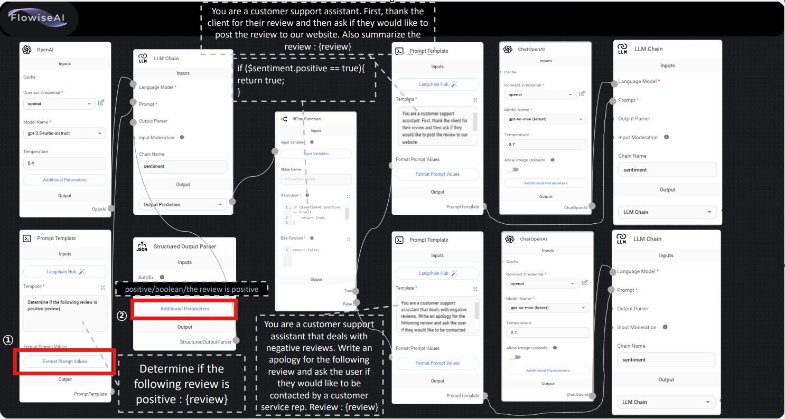

## 2-1.Multi_Chain_Chatbot
1. 주어진 교재대로 구성한다.
2. Format Prompt Value는 하기와 같이 구성한다.

    
   - <b>ingredient</b> 로 입력
   - null값 대신 question을 선택
     
   
   - <b>recipe</b> 로 입력
   - null값 대신 question을 선택
        
   

   
## 2-2.Multi_Chain_Chatbot
1. 주어진 교재대로 구성한다.
2. Format Prompt Value는 하기와 같이 구성한다.

    
   - <b>sentence</b> 로 입력
   - null값 대신 question을 선택
     
   

   
## 2-3.Multi_Chain_Chatbot
1. 주어진 교재대로 구성한다.
2. Format Prompt Value는 하기와 같이 구성한다.

    
   - <b>word</b> 로 입력
   - null값 대신 question을 선택
     
   

   
## 2-4.Multi_Chain_Chatbot
1. 주어진 교재대로 구성한다.
2. Format Prompt Value는 하기와 같이 구성한다.

    
   - <b>review</b> 로 입력
   - null값 대신 question을 선택
     
   
    
   - <b>positive , boolean  , the review is positive</b> 로 입력
     
   
