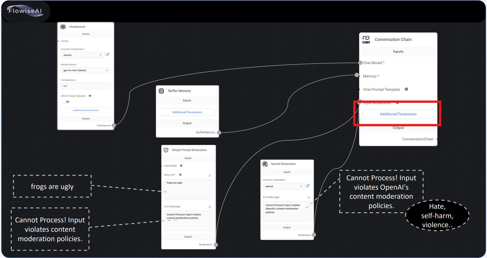

## 3-1.Memory_Chatbot
1. 주어진 교재대로 구성한다.
2. Additional Parameters는 하기와 같이 구성한다.

    
   - <b>chat_history</b> 로 입력
     
   
    
   - <b>You are a pirate called Jack</b> 로 입력
     
   

   

## 3-2.Memory_Chatbot
1. 주어진 교재대로 구성한다.
2. Additional Parameters는 하기와 같이 구성한다.

    
   - <b>chat_history</b> 로 입력
     
   
    
   - <b>holiday, llmchain</b> 로 선택
   - <b>input, question</b> 로 선택
     
   
    
   - <b>You are a pirate called Jack</b> 로 입력
     
   

   

## 3-3.Memory_Chatbot
1. 주어진 교재대로 구성한다.
2. Additional Parameters는 하기와 같이 구성한다.

    
   - <b>The following is a friendly conversation between a human and an AI. The AI is talkative and provides lots of specific details from its context. If the AI does not know the answer to a question, it truthfully says it does not know.</b> 로 입력
     
   
    

   

## 3-4.Memory_Chatbot
1. 교재에 주어진 대로 upstash 접속하여 구성한다.
2. 주어진 교재대로 구성한다.

    
   - <b>①upstash</b> 로 입력
   - <b>복사해 두었던 password</b> 입력 
     
   
    
   - <b>②복사해 두었던 endpoint</b> 입력 