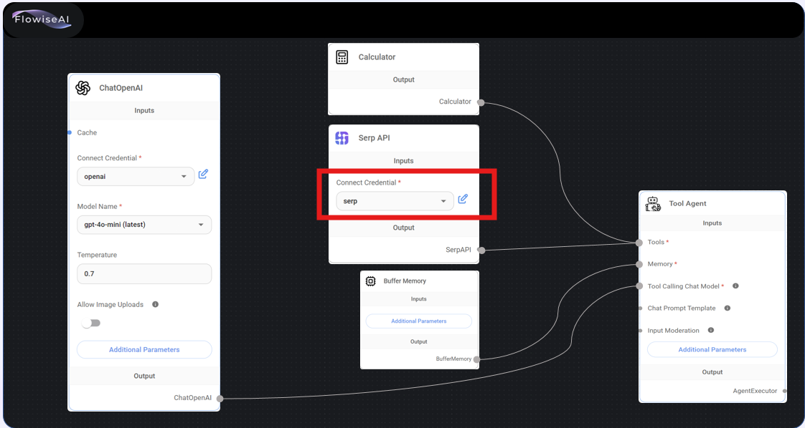
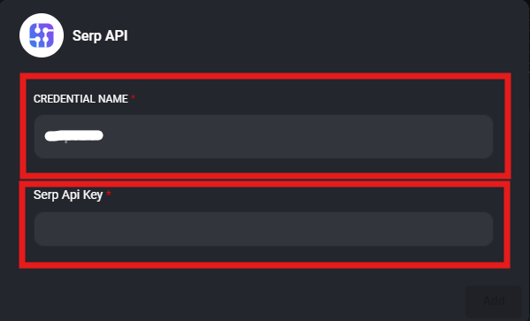
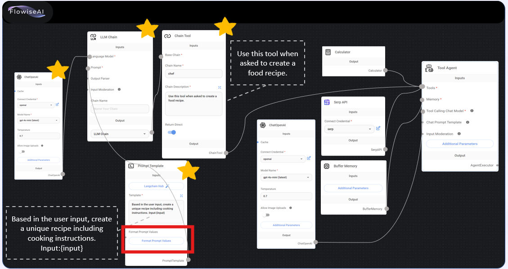
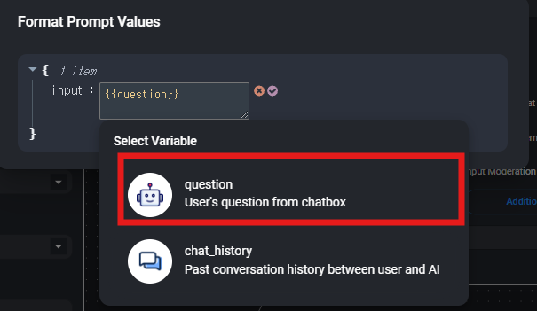

## 6-1.Agent_Powered_Chatbot
1. 주어진 교재대로 구성한다.
2. Connect Credential은 다음과 같이 구성한다.

    
   - <b>본인이 원하는 name</b> 으로 입력
   - <b>SerpApi에서 생성하여 복사한 api_key </b> 입력    

   
 

   
## 6-2.Agent_Powered_Chatbot
1. 주어진 교재대로 구성한다.
2. format Prompt Valuse는 하기와 같이 구성한다.

    
   - <b>input</b> 으로 입력
   - <b>question </b> 선택   

   
 

   