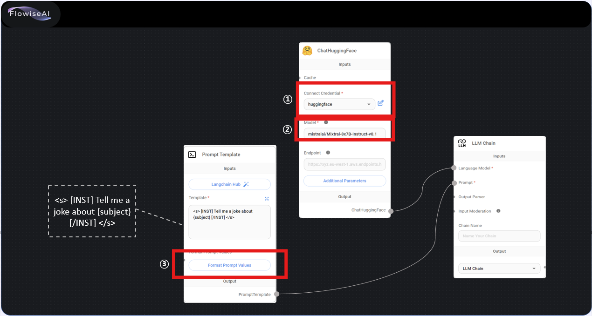
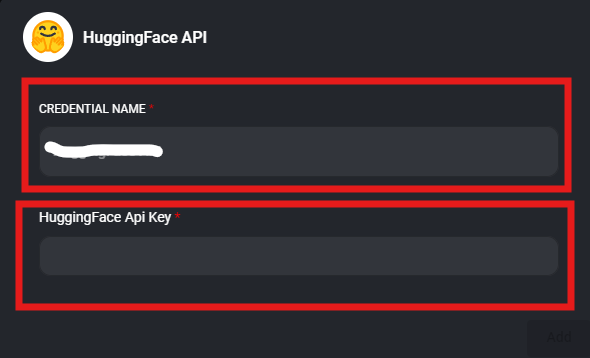
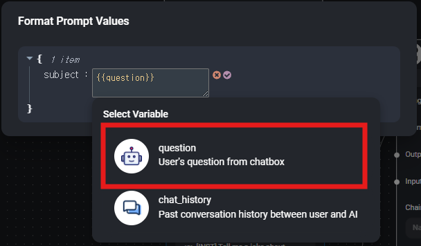

## 8-1.Hugging_Face_Chatbot
1. 주어진 교재대로 구성한다.
2. Connect Credential은 다음과 같이 구성한다.

    
   - <b>①본인이 원하는 name</b> 으로 입력
   - <b>HuggingFace에서 생성하여 복사한 token </b> 입력    

   
  
   - <b>②HuggingFace에서 생성하여 복사한 모델</b> 로 입력

     
   - ③<b>subject</b> 으로 입력
   - <b>question </b> 선택   

      
   