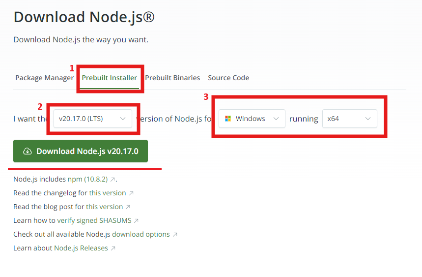

# NocodeLLM 과정 환경설정 가이드

## 실행 환경 개요
- OS: Windows
- Platform: flowise

## Node.JS 설치
다음 사이트에 접속하여 Node.js을 다운로드 받아 설치한다.
(https://nodejs.org/en/download/prebuilt-installer)

1. Prevuilt Installer 선택
2. 18버전 이상을 선택
3. 본인의 운영체제에 맞춰 선택
   

4. next를 눌러 설치 하다가, 해당 화면이 나오면 반드시 체크하여 설치를 완료한다.

   
   

## flowise 설치
1. Windows + R 키 입력하여 실행 창을 연 뒤, cmd를 입력하여 명령 프롬프트 창을 연다.

2. <b>npm install -g flowise</b> 입력 하여 설치 진행한다. (30분 소요)

   

## 기타 사이트 회원 가입
가입 절차는 클릭만으로 간단히 진행할 수 있으므로 생략 하겠다. 

  . pinecone https://www.pinecone.io/
  
  . render https://render.com
  
  . github https://www.github.com
  
  . serpapi https://serpapi.com
  
  . langchain smith https://smith.langchain.com
  
  . huggingface https://huggingface.co
  
  . upstash https://console.upstash.com
  
  . replicate https://replicate.com/

   
